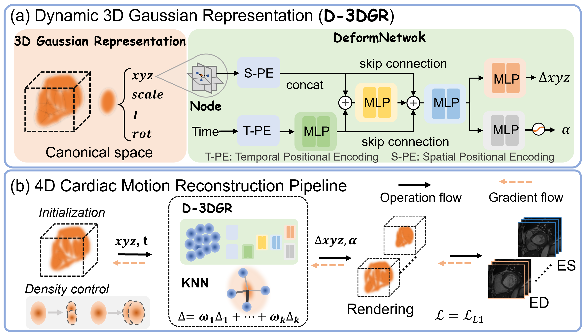

# Dyna3DGR: Dynamic 3D Gaussian Representation for Cardiac Medical Imaging

Xueming Fu, Pei Wu, Yingtai Li, Xin Luo, Zihang Jiang, Junhao Mei, Jian Lu, Gao-Jun Teng, Shaohua Kevin Zhou

**International Conference on Medical Image Computing and Computer-Assisted Intervention (MICCAI), 2025**

[](https://arxiv.org/pdf/2507.16608)

<p align="center">
  
</p>

## Abstract

This repository contains the official implementation of **Dyna3DGR: 4D Cardiac Motion Tracking with Dynamic 3D Gaussian Representation** (MICCAI 2025).

Reconstructing dynamic 3D cardiac structures from sparse or limited-angle perspectives remains a challenging task in medical imaging. We propose **Dyna3DGR**, a novel framework that leverages Dynamic 3D Gaussian Splatting for high-fidelity 4D cardiac reconstruction and motion tracking. By introducing a control node-based deformation field and integrating it with 3D Gaussian primitives, our method captures complex cardiac motions with high temporal consistency and spatial accuracy.

## Project Structure

```
Dyna3DGR/
├── train.py                    # Main training script
├── requirements.txt            # Python dependencies
├── LICENSE                     # License file
├── README.md                   # This file
├── arguments/
│   └── __init__.py             # Training arguments and configurations
├── data/
│   └── toydata/                # Sample data for quick testing
│       ├── ACDC_info.json      # Patient metadata
│       └── training/
│           └── patient001/     # Sample patient data
├── scene/
│   ├── __init__.py
│   ├── gaussian_model.py       # 3D Gaussian model for cardiac imaging
│   └── deform_model.py         # Deformation model for motion tracking
├── utils/
│   ├── __init__.py
│   ├── time_utils.py           # Deformation networks (DeformNetwork, ControlNodeWarp)
│   ├── general_utils.py        # General utility functions
│   ├── deform_utils.py         # Deformation utilities
│   ├── loss_utils.py           # Loss functions
│   ├── sh_utils.py             # Spherical harmonics utilities
│   ├── graphics_utils.py       # Graphics utilities
│   ├── system_utils.py         # System utilities
│   └── Compute_intensity.py    # Intensity computation CUDA kernel
└── submodules/
    ├── diff-gaussian-rasterization/  # Differential Gaussian rasterization
    └── simple-knn/                    # Simple KNN implementation
```

## Key Features

- **3D Gaussian Splatting for Medical Imaging**: Extends 3D Gaussian Splatting to volumetric medical image reconstruction
- **Dynamic Deformation Modeling**: Uses control node-based deformation for cardiac motion tracking
- **Cone-beam CT Projection**: Implements differentiable cone-beam CT forward and back projection

## Dataset: ACDC (Automated Cardiac Diagnosis Challenge)

### Dataset Structure

```
ACDC/
├── training/                    # Patients 001-100
│   └── patient{XXX}/
│       ├── patient{XXX}_frame{YY}.nii.gz      # MRI image
│       └── patient{XXX}_frame{YY}_gt.nii.gz   # Ground truth segmentation
└── testing/                     # Patients 101+
    └── patient{XXX}/
        └── ...

# Additionally required:
ACDC_info.json                   # Contains ED/ES frame indices for each patient
```

### Label Values
| Label | Structure |
|-------|-----------|
| 1     | Right Ventricle (RV) |
| 2     | Myocardium (MYO) |
| 3     | Left Ventricle (LV) |
| 4     | All structures |

### Data Processing Pipeline

1. **Frame Selection**: Extract End-Diastole (ED) and End-Systole (ES) frames
2. **Resampling**: Resample to isotropic spacing `[1.5, 1.5, 3.15]` mm
3. **Cropping/Padding**: Center crop or pad to target size `[128, 128, 32]`
4. **Label Masking**: Apply cardiac structure mask based on selected label
5. **Normalization**: Clip values to [0, 250] and normalize to [0, 1]

### Output Format
- **Images**: `(128, 128, 32, 2)` - (H, W, D, Frames) with ED and ES frames
- **Labels**: `(128, 128, 32, 2)` - Corresponding segmentation masks

## Installation

1. Clone this repository
2. Install dependencies:
```bash
pip install -r requirements.txt
```

3. Build the CUDA submodules:
```bash
cd submodules/diff-gaussian-rasterization
pip install .

cd ../simple-knn
pip install .
```

## Dependencies

- PyTorch >= 1.12
- CUDA >= 11.3
- SimpleITK (for medical image I/O)
- ODL (Operator Discretization Library) for CT projection
- MONAI for medical image metrics
- PyTorch3D
- nibabel

## Quick Start (with Toy Data)

A sample patient data (patient001) is included in `data/toydata/` for quick testing:

```bash
python train.py \
    --data_root ./data/toydata \
    --acdc_info ./data/toydata/ACDC_info.json \
    --model_path ./checkpoints \
    --result_path ./results \
    --group 0 \
    --label 3
```

## Usage (Full Dataset)

```bash
python train.py \
    --data_root /path/to/ACDC \
    --acdc_info /path/to/ACDC_info.json \
    --model_path /path/to/checkpoints \
    --result_path /path/to/results \
    --group 0 \
    --label 3
```

### Arguments
| Argument | Description |
|----------|-------------|
| `--data_root` | Root directory of ACDC dataset |
| `--acdc_info` | Path to ACDC_info.json with ED/ES frame indices |
| `--model_path` | Directory to save model checkpoints |
| `--result_path` | Directory to save results |
| `--group` | Patient group (0-9, each group contains 10 patients) |
| `--label` | Cardiac structure label (1=RV, 2=MYO, 3=LV, 4=All) |

## Acknowledgement

We thank the authors of [SC-GS](https://github.com/CVMI-Lab/SC-GS) for their excellent codebase, which served as a foundation for our implementation.

## Citation

If you find this code useful for your research, please cite our paper:

```bibtex
@inproceedings{fu2025dyna3dgr,
  title={Dyna3DGR: 4D Cardiac Motion Tracking with Dynamic 3D Gaussian Representation},
  author={Fu, Xueming and Wu, Pei and Li, Yingtai and Luo, Xin and Jiang, Zihang and Mei, Junhao and Lu, Jian and Teng, Gao-Jun and Zhou, Shaohua Kevin},
  booktitle={International Conference on Medical Image Computing and Computer-Assisted Intervention},
  pages={164--174},
  year={2025},
  organization={Springer}
}
```

## License

This project is licensed under the terms specified in the LICENSE file.
